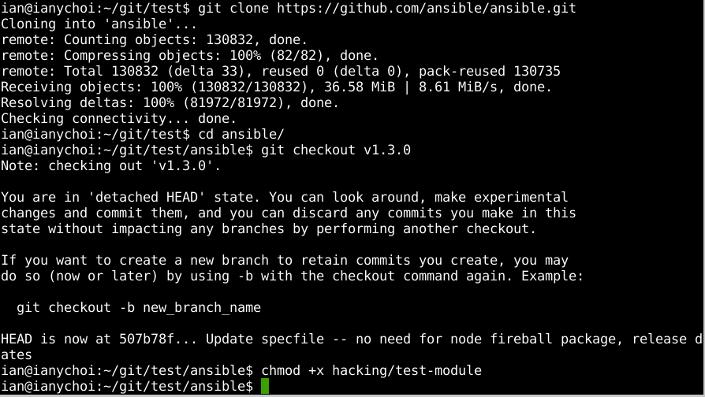
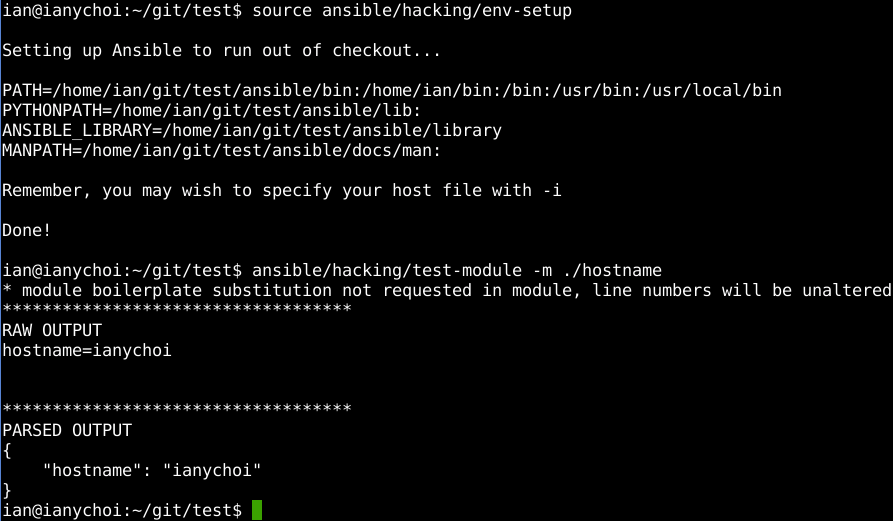
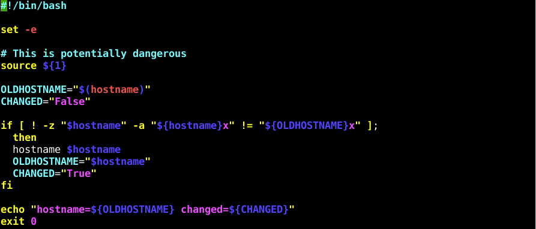
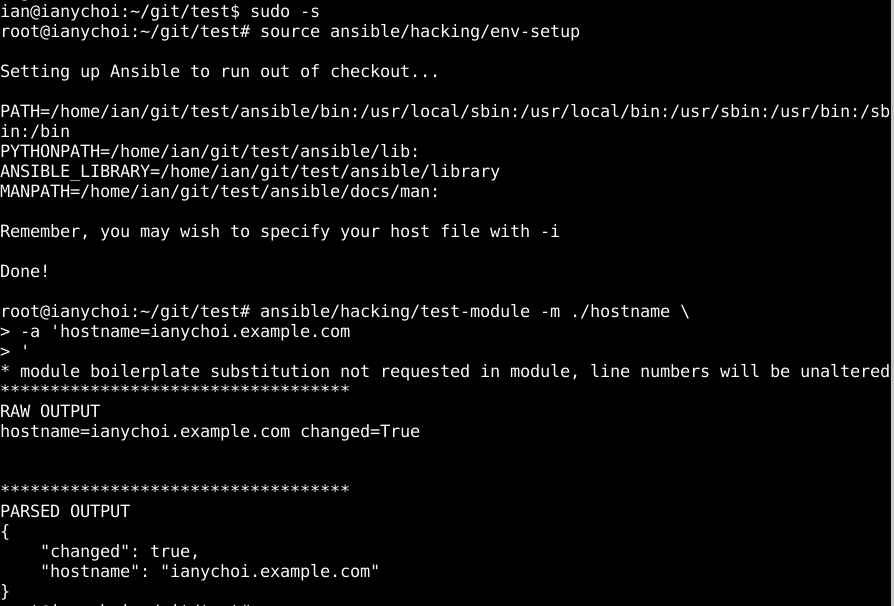
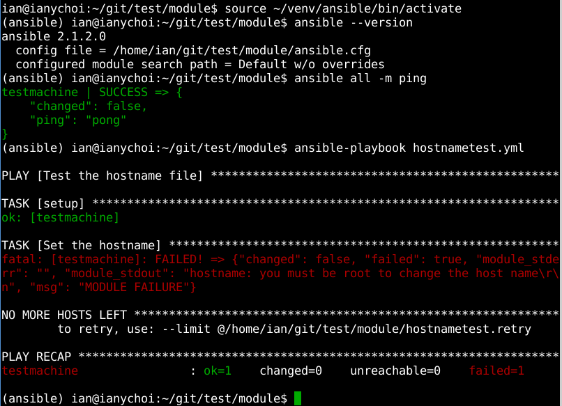
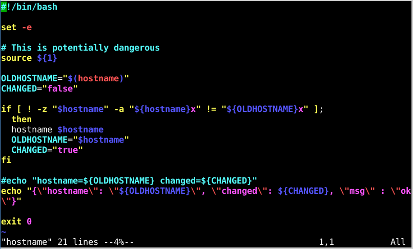

# Chapter 5. 사용자 정의 모듈

## 작성자
- Bash: Ian Y. Choi
- Python: SeongSoo Cho

## 개요

- 살펴볼 내용
  - 배시 스크립트 또는 파이썬으로 모듈을 작성하는 방법
  - 개발한 사용자 정의 모듈을 사용하기
  - 인벤토리로서 외부 데이터 소스를 사용하는 스크립트 작성하기

- 스크립트 대신 모듈을 사용하는 상황
  - 매번 스크립트를 실행하기 원하지 않을 때
  - 출력을 처리할 필요가 있을 때
  - 자바스크립트를 팩트로 만들 필요가 있을 때
  - 복잡한 변수를 인수로 보낼 필요가 있을 때

- ansible 소스 다운로드 필요
  - $ git clone https://github.com/ansible/ansible.git
  - $ cd ansible
  - $ git checkout v1.3.0
  - $ chmod +x hacking/test-module



## 배시로 모듈 작성

- 1. 스크립트 작성 [Source](bash_exercises/hostname_v1)


- 2. 실행시 오류 발생


- 3. 해결책: ansible 실행을 위한 환경 변수 source
  - https://github.com/ansible/ansible/issues/5105



- 4. 두 번째: 개선된 스크립트 [Source](bash_exercises/hostname_v2)



- 5. sudo를 활용한 실행 필요



- 6. 두 번째 실행하였을 때는 changed가 False가 됨


- 7. Playbook 모듈로 실행시 fail



- 8. 그러나 호스트 이름이 변경된 것으로 확인됨


- 9. 세 번째: JSON을 echo하도록 개선한 스크립트
  [Source](bash_exercises/module/library/hostname)
  - http://stackoverflow.com/questions/34960794/why-does-my-custom-ansible-module-fail



- 10. 실행 완료


----------

## Python 으로 Custom 모듈 작성

* Python 으로 module 개발은 boilerplate 를 사용 ( 코드량 대폭 감소 가능)
* Module의 Arguments는 자동으로 처리됨
* Output 은 JSON 으로 자동 변환
* Ansible upstream 은 boilerplate 로 작성된 Python 플러그인만 accept 함.

boilerplate 는 AnsibleModule 클래스를 이용해서 작업을 진행하고, 아래오 가타은 helper 함수를 지원한다.

* run_command : 외부 명령어를 실행하고, return code, stdout, stderr 를 반환한다.
* exit_json : module 이 작업을 끝내면, ansible 에게 값을 반환한다.
* fail_json : ansible 에게 에러가 발생했음을 메세지와 함께 알려준다.

### Sample Code
```Python
from ansible.module_utils.basic import AnsibleModule

def main():
    module = AnsibleModule(
        argument_spec = dict(
            state     = dict(default='present', choices=['present', 'absent']),
            name      = dict(required=True),
            enabled   = dict(required=True, type='bool'),
            something = dict(aliases=['whatever'])
        )
    )

if __name__ == '__main__':
    main()
```

### 모듈 테스트
ansible 에서 제공해주는 test-module 을 이용하여 간편하게 모듈 테스트 가능

```
git clone git://github.com/ansible/ansible.git --recursive
source ansible/hacking/env-setup

ansible/hacking/test-module -m ./timetest.py
```
